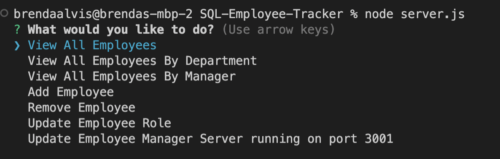
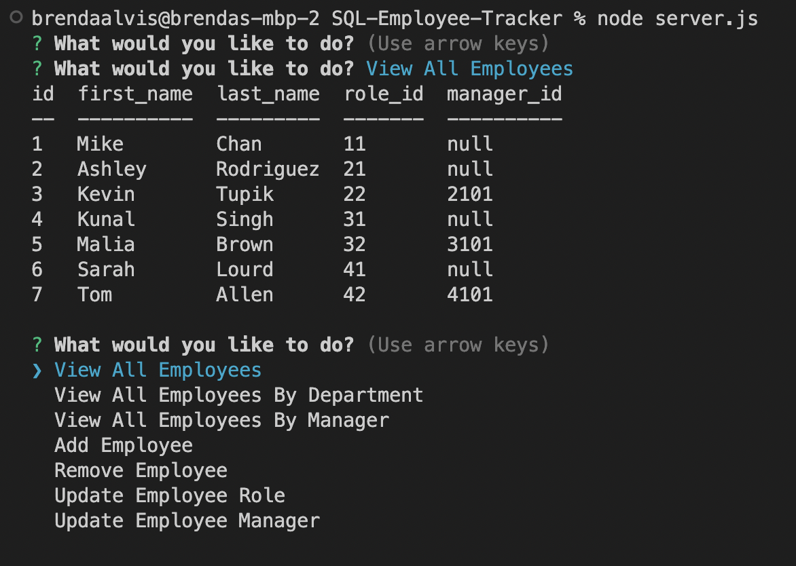

# SQL-Employee-Tracker
### Licenses

 ## Description
 
 This is a backend application designed to organize employee information in a database for organizations. This application can store data based on user input. 
 
 ## How To

 To use this application, users should have node.js and MySQL installed. Additionally, users should install the npm inquirer package, MySQL2 package, and the console.table package.

 * Step one: Open the terminal and type "node server.js.
 
 
 
 * Step two: Answer the propmpts.
 

## DEMO

 [DEMO](https://drive.google.com/file/d/1xQpKoY3qxa5bVX8XCK7_bBf97V8Yse01/view?usp=sharing)

 ## Credits & Resources
 I used many examples from the UT resources provided in class. 